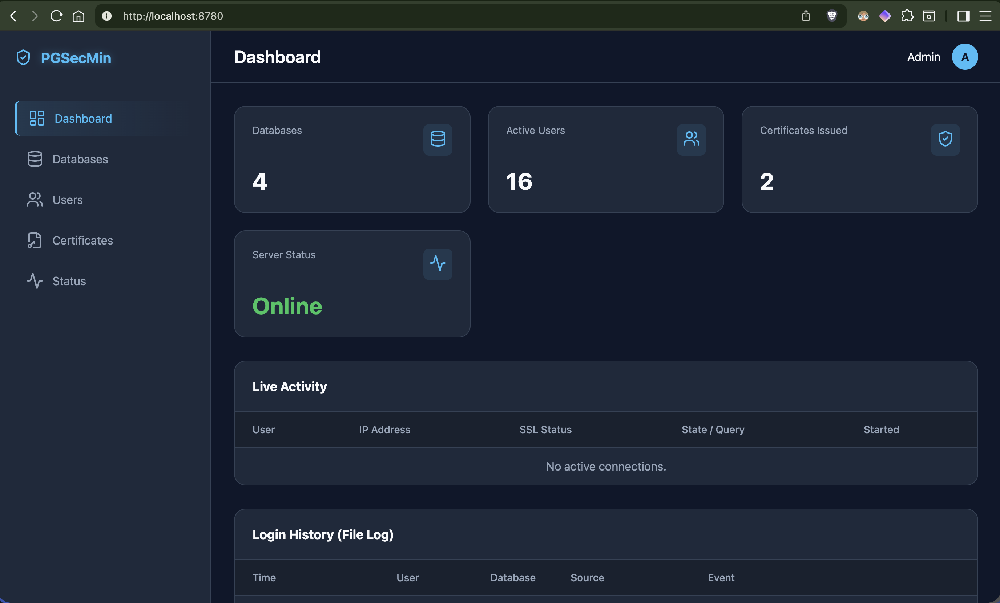

# pgcertmin

A PostgreSQL security min-lab environment focusing on SSL configuration and Client Certificate Authentication.



## Features

- **PostgreSQL 16** running in Docker.
- **SSL Enabled**: Server configured with SSL.
- **Client Certificate Authentication**: Enforced verification for client connections.
- **Management UI**: A web interface to manage databases, users, and certificates.
- **Logging**: Detailed logging of connections and disconnections.

## Getting Started

### Prerequisites

- Docker & Docker Compose
- Node.js (v20+)

### Installation

1.  Clone the repository:
    ```bash
    git clone https://github.com/markwylde/pgcertmin.git
    cd pgcertmin
    ```

2.  Install dependencies:
    ```bash
    npm install
    ```

3.  Start the application and database:
    ```bash
    docker-compose up -d
    npm run dev
    ```

4.  Access the UI at `http://localhost:3000`.

## Automatic Backups

The application supports automatic scheduled backups using configurable cron expressions. You can schedule full, differential, and incremental backups independently.

### Configuration

Set the following environment variables to enable automatic backups:

```bash
# Full backup every Sunday at 2 AM
BACKUP_SCHEDULE_FULL="0 2 * * 0"

# Differential backup every Wednesday at 2 AM
BACKUP_SCHEDULE_DIFF="0 2 * * 3"

# Incremental backup Monday-Saturday at 2 AM
BACKUP_SCHEDULE_INCR="0 2 * * 1-6"
```

Cron format: `"minute hour day-of-month month day-of-week"`

Common examples:
- `"0 2 * * *"` - Every day at 2 AM
- `"0 */6 * * *"` - Every 6 hours
- `"30 3 * * 1-5"` - Weekdays at 3:30 AM
- `"0 0 1 * *"` - First day of every month at midnight

### Usage

1. Create a `.env` file or set environment variables in `docker-compose.override.yml`
2. Restart the application: `docker-compose restart pgsecmin`
3. Check scheduler status via API: `GET /backups/scheduler`

The scheduler will automatically:
- Skip scheduled backups if one is already running
- Log all scheduled backup attempts
- Run backups in the background without blocking the application

## Architecture

- `docker-compose.yml`: Defines the PostgreSQL service configuration.
- `local-certs/`: Stores generated SSL certificates.
- `src/`: Backend Node.js application (Express).
- `public/`: Frontend assets.
- `postgres-config/`: PostgreSQL configuration files (init.sql, pg_hba.conf).
